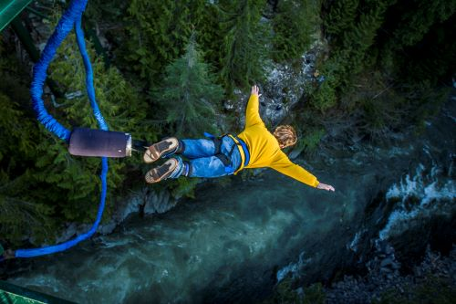

# **My super exciting very cool day** #
## *Daily routine* ##
---
>7:00am-9:00am
#### Wake up
#### Bathroom things/ make up
#### Help kiddos get dressed
---
>9:00am-5:00pm on Mondays and Wednesdays
- Ethnic studies and English
- Escape Room
- Bungee Jumping  
---
>9:00am-5:00pm on Tuesdays and Thurdays
1. Work
2. Skydiving
---
>5:00pm-7:00pm
#### Feed my family
#### Play with my kids/family
#### Get kids ready for bed
---
>7:00pm-9:00pm
#### Put kids to bed
#### Nightly routine- clean up- trash, dishes, etc.
---
>9:00pm-10:30pm
#### Get ready for bed
#### Watch some TV with my partner
#### Go to sleep
---